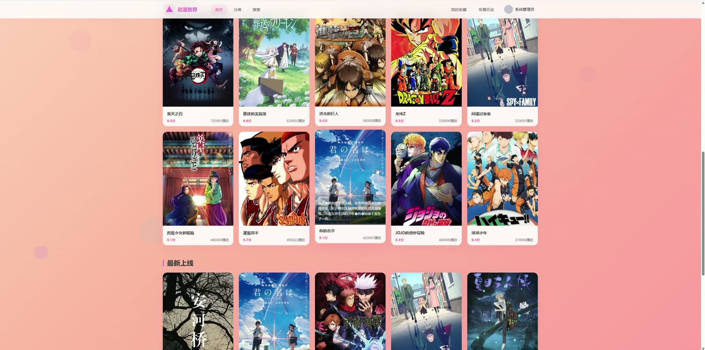
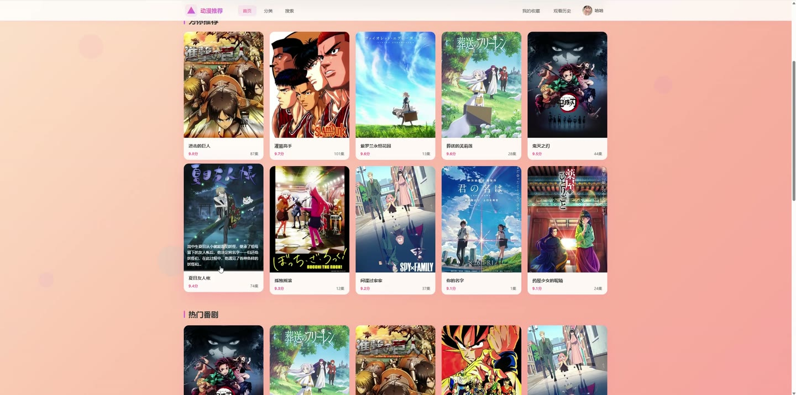
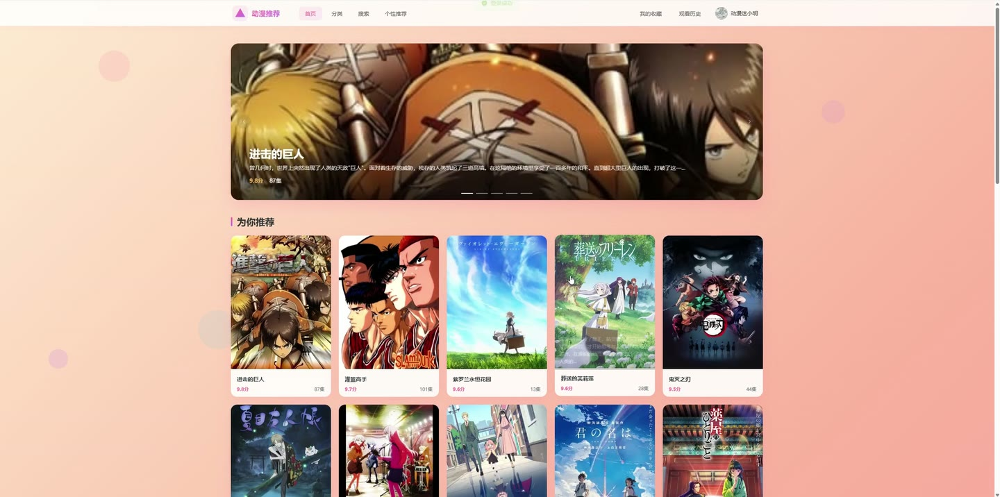
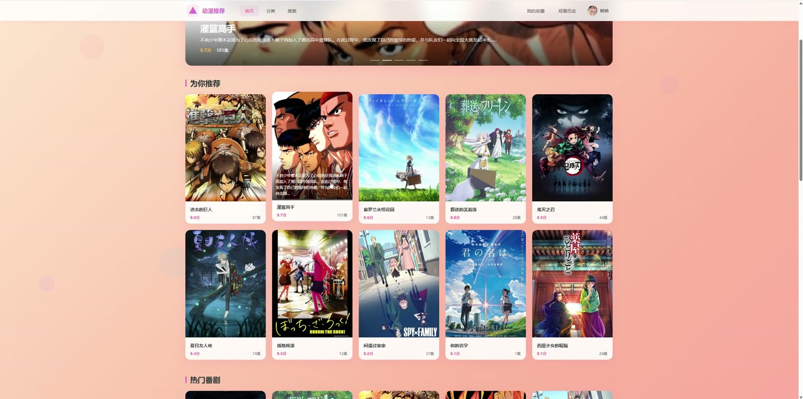
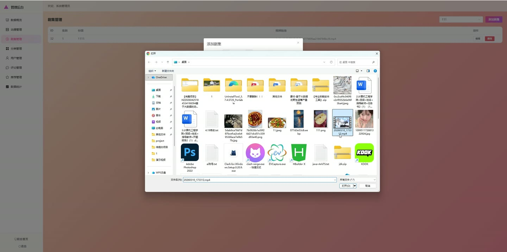
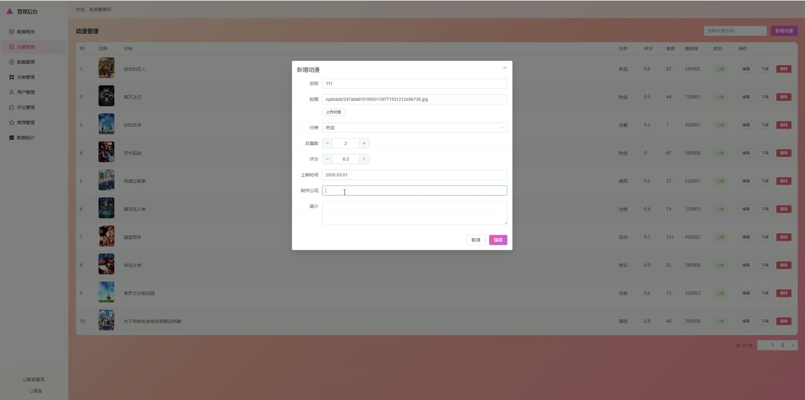

# (附文档)Springboot3+Vue3+MySQL 动漫推荐管理系统

**技术栈**：Springboot3、Vue3、MySQL

### 系统简介

动漫推荐管理系统是一套基于 Spring Boot 3 + Vue 3 的前后端分离系统，提供动漫浏览、播放、收藏、评论及个性化推荐功能。系统包含普通用户端与管理员端两个角色，普通用户可浏览番剧、观看剧集、收藏动漫、发表评论、查看观看历史；管理员负责动漫/剧集/分类/用户/评论/推荐的管理以及数据统计。
 
### 核心功能
 
### 普通用户端

 
- 浏览首页推荐区：查看系统推荐的动漫列表（支持热门、最新、高分等分类展示） 
- 动漫分类浏览：按动漫分类查看该分类下的动漫列表 
- 动漫详情查看：点击动漫进入详情页，查看封面、评分、集数、简介、制作公司等信息 
- 动漫搜索：通过关键字（标题/描述）搜索动漫，支持按分类筛选 
- 剧集播放：选择动漫的某一集进行在线播放，支持记录播放进度 
- 收藏/取消收藏：在动漫详情页点击收藏按钮，一键收藏或取消收藏该动漫 
- 查看收藏列表：在“我的收藏”页面查看所有已收藏的动漫 
- 发表评论：在动漫详情页发表评论（需登录），评论提交后需管理员审核 
- 查看观看历史：在“观看历史”页面查看最近观看的动漫及对应剧集和播放进度 
- 个人资料编辑：修改昵称、邮箱、头像等个人信息 
- 修改密码：输入原密码和新密码进行密码修改 
- 个性化推荐：系统根据用户的收藏和观看记录，通过协同过滤算法推荐相似动漫（新用户显示热门推荐） 
- 找回密码：通过注册时填写的用户名和邮箱重置密码 
- 账号注册与登录：支持用户名密码注册/登录，以及快速体验登录（管理员/普通用户）
 
### 管理员端

 
- 数据概览：查看平台总用户数、动漫总数、评论总数、收藏总数、总播放量 
- 动漫管理：新增/编辑/删除动漫信息（名称、封面、分类、集数、评分、上映时间、制作公司、简介） 
- 动漫上下架：一键切换动漫的上架/下架状态 
- 剧集管理：为每个动漫新增/编辑/删除剧集（集数编号、标题、视频地址、排序） 
- 分类管理：新增/编辑/删除动漫分类（名称、排序） 
- 用户管理：查看用户列表（支持按用户名搜索），编辑用户信息（昵称、邮箱、角色、状态），重置用户密码 
- 评论管理：查看所有评论列表（支持按动漫筛选），审核通过/驳回评论，删除评论 
- 推荐管理：设置动漫的推荐/热门/最新标签 
- 数据统计：查看播放量 TOP10 动漫排行，以及各分类下的动漫数量分布
 
### 技术栈

 后端框架Spring Boot 3 ORMMyBatis-Plus 权限Session 登录校验（角色区分 ADMIN/USER） 前端框架Vue 3 状态管理Pinia 构建工具Vite 数据库MySQL UI 组件库Element Plus 路由Vue Router
 
### 交付内容

 
- 后端完整源码 
- 前端完整源码 
- 数据库初始化脚本 
- 万字文档

## 界面展示

---

## 获取完整源码 + 万字文档

本仓库为项目介绍页。**完整前后端源码、数据库初始化脚本、万字项目文档**，请加微信 `kangkangcode`，或访问 [codekk.top](http://codekk.top) 获取。

可作课程设计 / 毕业设计参考，支持远程部署调试。